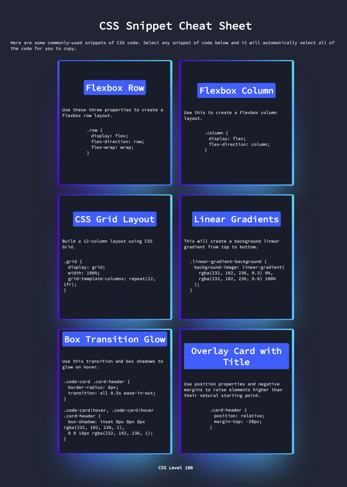

# CSS-Cheat-Sheet
Here are some commonly-used snippets of CSS code. Select any snippet of code below and it will automatically select all of the code for you to copy.

## Link
Link: [CSS-Cheat-Sheet](https://robertsolorzano.github.io/CSS-Cheat-Sheet/)

## Preview

## Credits

**Sources for CSS Styles & animation:**

[Magic Card by Gayane Gasparyan](https://codepen.io/gayane-gasparyan/pen/jOmaBQK)

[Google Fonts](https://fonts.google.com/)

## License

Please refer to the LICENSE in the repo.